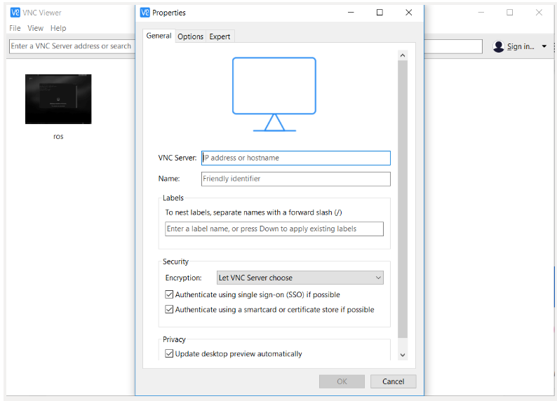
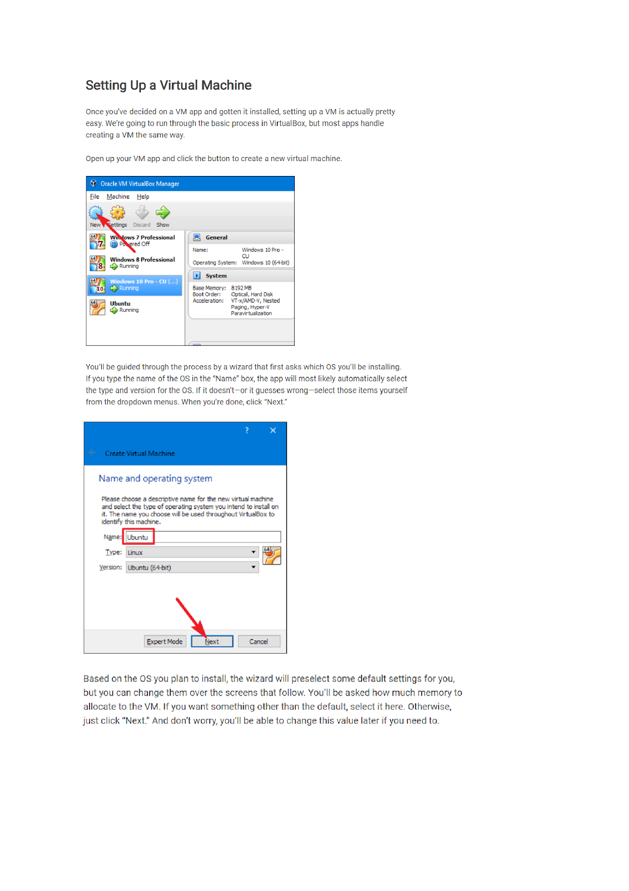
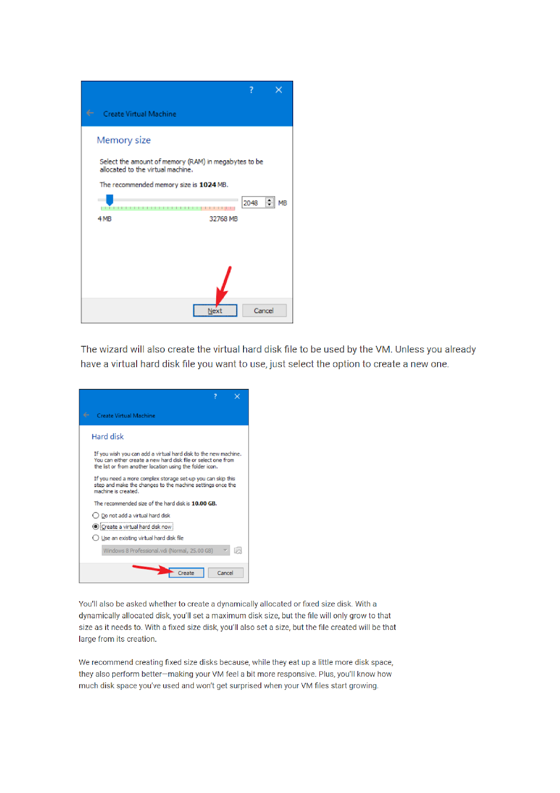
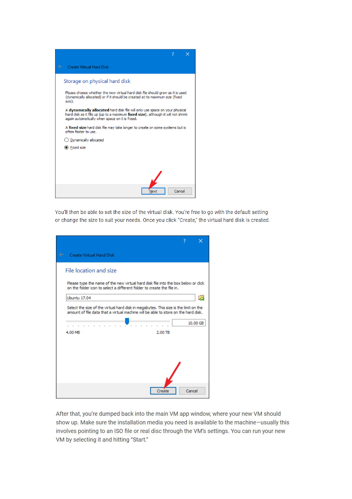
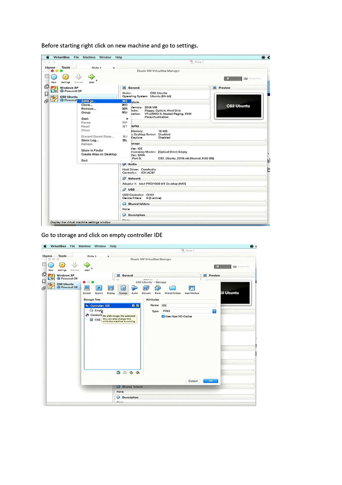
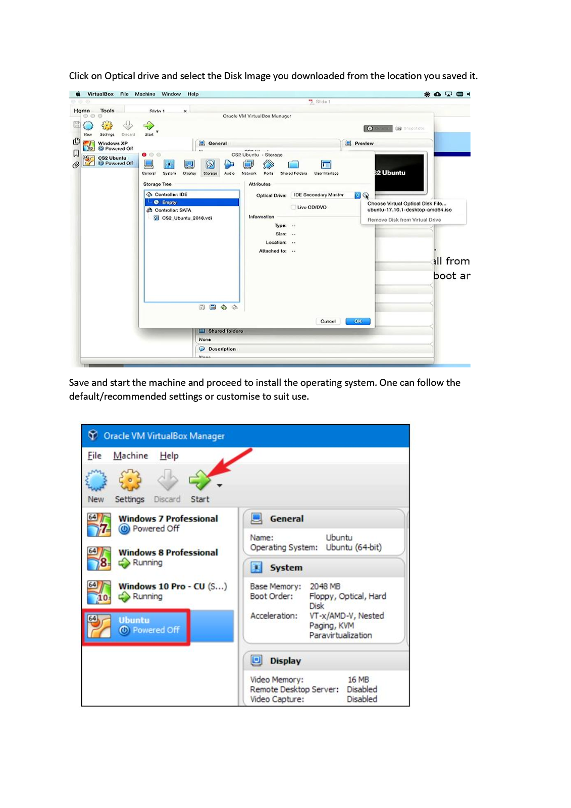

# DikokoMScEng

<!-- toc -->
## Kuboki Platform Setup
 
Get the Raspberry PI image from [image](https://drive.google.com/drive/folders/1w1sGBSpiR5CB8JSMo9wTCWxfJ0DsrZZv).

Then using [balenaEtcher](https://www.balena.io/etcher/) to burn the image to an SD card.

### Setting up the robot

1) Turn on the RPi (I use a small USB power bank for power) and Kobuki base.
2) Connect to the RPi's wireless network (SSID: jarvis-net, Password: CogRobNetwork).
3) Login using SSH run `ssh guest@192.168.42.1`(Username: guest, Password: HelloWorld) is suggest you use termius as the client.
4) Make sure to run `roscore` in command line.
5) You can run `roslaunch turtlebot_bringup minimal.launch` on the RPi to startup the Turtlebot ROS nodes or `sudo chmod a+rw /dev/ttyACM0`, `roslaunch turtlebot_bringup minimal_with_hokuyo.launch` to startup the Turtlebot ROS nodes with hokuyo.
6) You can run `roslaunch turtlebot_teleop keyboard_teleop.launch` to control via Keyboard or `roslaunch turtlebot_teleop logitech.launch`
on the RPi to startup the Logitech Controller  ROS nodes.

Note: You will lose internet connectivity on your laptop when connected to the RPi and you'll need to setup your ROS IP addresses if you need to run nodes on other devices. 
If you need to download packages for the RPi you have to connect it via ethernet, as it's wifi is dedicated to setting up it's own network.

### Adding a sensor

[Generic](http://wiki.ros.org/turtlebot/Tutorials/indigo/Adding%20New%203D%20Sensor)

[Hokuyo UTM-30LX](http://wiki.ros.org/turtlebot/Tutorials/indigo/Adding%20a%20lidar%20to%20the%20turtlebot%20using%20hector_models%20%28Hokuyo%20UTM-30LX%29)


### Add Sensor to the Robot URDF

There are many ways to add the sensor to the Robot's URDF. The method I found to be the most straight forward uses the hector_models package which currently contains the URDF and meshes for Asus camera, Flir_a35_camera, Hokuyo UTM30lx, Kinect_camera, realsense camera, sonar_sensor, thermaleye camera and VLP16. Install the hector_models package with

```sudo apt-get install ros-indigo-hector-models```

Then add the sensor URDF.XACRO into the Robot model. For the turtlebot using the kinect, Now go the file `/opt/ros/kinetic/share/turtlebot_description/robots/kobuki_hexagons_kinect.urdf.xacro` and add the following lines.
Note you will need sudo permissions to edit this file.
Add this right after the `<robot>` tag

```xml
<xacro:include filename="$(find hector_sensors_description)/urdf/hokuyo_utm30lx.urdf.xacro"/>
```

Add this right before the `</robot>` tag. Make sure this code block passes all the parameters required by the respective sensor URDF. Also update the xyz and rpy parameters to reflect the geometry of the sensor on the robot with respect to the chosen parent link.

```xml
 <hokuyo_utm30lx_model name="hokuyo_laser" parent="base_link">
    <origin xyz="0 0 0 " rpy="0 0 0" />
 </hokuyo_utm30lx_model>
```

Test that the xacro file compiles correctly by running:

```rosrun xacro xacro kobuki_hexagons_kinect.urdf.xacro > ~/temp.xml```

### Add the Hokuyo node to new launch file

Copy the default minimal.launch file to `minimal_with_hokuyo.launch` in `/opt/ros/kinetic/share/turtlebot_bringup/launch` folder.
Note you will need sudo permissions to do this therefore run:
`sudo vi minimal_hokuyo.launch`

Add the following lines before the `</launch>` tag towards the end, updating the parameters as required, especially the frame_id:

```xml
<node name="hokuyo" pkg="urg_node" type="urg_node" respawn="false" output="screen">
  <param name="calibrate_time" type="bool" value="true"/>
  <param name="port" type="string" value="/dev/ttyACM0"/>
  <param name="intensity" type="bool" value="false"/>
  <param name="min_ang" value="-2.2689"/>
  <param name="max_ang" value="+2.2689"/>
  <param name="cluster" value="1"/>
  <param name="frame_id" value="hokuyo_laser_frame"/>
 </node>
<node pkg="tf" type="static_transform_publisher" name="base_link_2_laser_link" args="0.07 0 0.16 0 0 0 1 /base_link /hokuyo_laser_frame 100"/>

 <node name="joint_state_publisher" pkg="joint_state_publisher" type="joint_state_publisher">
 <param name="use_gui" value="false"/>
 </node>
```

### Record to hard drive

#### Mount external HDD

```sudo blkid```

```sudo mount /dev/sda1 /mnt/Personal```

```rosbag record -o /mnt/guest/Personal/ROSBAG-Readings/fileName -a```

```rosbag record -o /mnt/guest/Personal/ROSBAG-Readings/fileName -a -b 1024```

```rosbag record -o fileName -a```

### Connecting to Pi via VNC on Windows Machine

**How to install and setup a VNC connection over an SSH tunnel:**

1) Log in to the server over SSH.
2) Run the command vncserver :1.
3) Open VNC Viewer and Click on File > New connection.

4) Fill out IP Address and Name and open the connection.
5) You may be asked for the username and password.

## Setting up Virtual Box with ROS to connect to TurtleBot

1) Download VirtualBox
2) Download Ubuntu 16.04 disk image
3) Follow the next steps below:






Note: After installing the virtual machine, now you can install ROS and all its dependencies using the command line. The ROS installation steps can be found on : [ROS Kinetic](http://wiki.ros.org/kinetic/Installation/Ubuntu).

### Enable SSH

Search for and install the **openssh-server** package from Ubuntu Software Center. Or run command below in console if you’re on Ubuntu Server without GUI:

```sudo apt-get install openssh-server```

Once installed, the SSH service should be started automatically. If necessary, you can start (or stop, restart) the service manually via command:

```sudo service ssh start```

### Network setup ROS

Say we have 3 computers connected to the same network which for the sake of the example is `192.168.42.1` with network mask of `255.255.255.0`. And the hostnames and IP addresses of the 3 computers are:

|hostname|TurtleBot|laptop|comp3|
|--------|---------|------|-----|
|IP |192.168.42.1|192.168.42.17|192.168.42.20|

### Configuring the ROS master

There should be 1 master/1 ROS core for handling the system. In this example, lets say that TurtleBot is the master. There is actually nothing much to do other than to just run roscore:
TurtleBot:`$ roscore`

### Configuring the slaves

In the case of slave machines, these need to know the master's IP address. Additionally, ROS is not that smart, meaning that you have to tell the ROS running on the slave machine it's own IP address. That's probably because a computer usually has multiple network interfaces and ROS is not sure about which one is used to communicate with the master. SO: 

1) Specify ROS master IP address: 11311 is the default port of the master. If for some reason it differs from the default value, use the different value accordingly. You can see the port nr. if you run roscore on the master machine.
    - for comp2:
 laptop:
 `$ export ROS_MASTER_URI=http://192.168.42.1:11311`

    - for comp3:
 comp3:`$ export ROS_MASTER_URI=http://192.168.42.1:11311`

2) Specify slave machine's own IP:

    - for laptop:
  laptop:`$ export ROS_IP=192.168.42.17`

    - for comp3:
 comp3:`$ export ROS_IP=192.168.42.20`


## Python Implementation

Python requirements

- Install Anaconda

- Use [requirements.txt](./requirements.txt) to create environment `$ conda create --name <env> --file requirements.txt`

Note the environment is run on python 3.6

### Ransac Parameter setting    

See [RansacReprojection](./RansacReprojection) folder for [results](./RansacReprojection/ImageMergeOnly) and python [file](./RansacReprojection/ImageMerge.py)

### Map Merging in ROS

When running the map merging in ROS place the [multi_robot_map_merging](./multi_robot_map_merging) in to catkin.

Then to run use `roslaunch multi_robot_map_merging start_merge.launch`. This assumes that there are already maps being published in the network, if that wasn't done correclty please follow steps above.

### Map Merging with exported images(.pgm)

To process files offline from ROS, export the maps using [map_saver](http://wiki.ros.org/map_server) `rosrun map_server map_saver [--occ <threshold_occupied>] [--free <threshold_free>] [-f <mapname>] map:=/your/costmap/topic`. This will give both a .pgm and .yml file. The files can then be used in merging operations.

The following project allows you to process the maps 2 or more maps being merged.

Project is in [Export](./ExportMerging) in [main.py](./ExportMerging/main.py) the following statement deternines the files to be processed.

```python
if __name__ == "__main__":

    # Number of maps to merge at a time for example 3 will simulate 3 maps being merged
    nums = [2]

    # Specify image folder
    images_maze = {'name': 'Maze','images': glob.glob('inputmaps/maze/*.pgm') }
    images = [images_maze]

    for num in nums:
        main(images, num)
        
    pass
```

example folder output is attached in [output_overlap](./ExportMerging/outputs_overlap)
